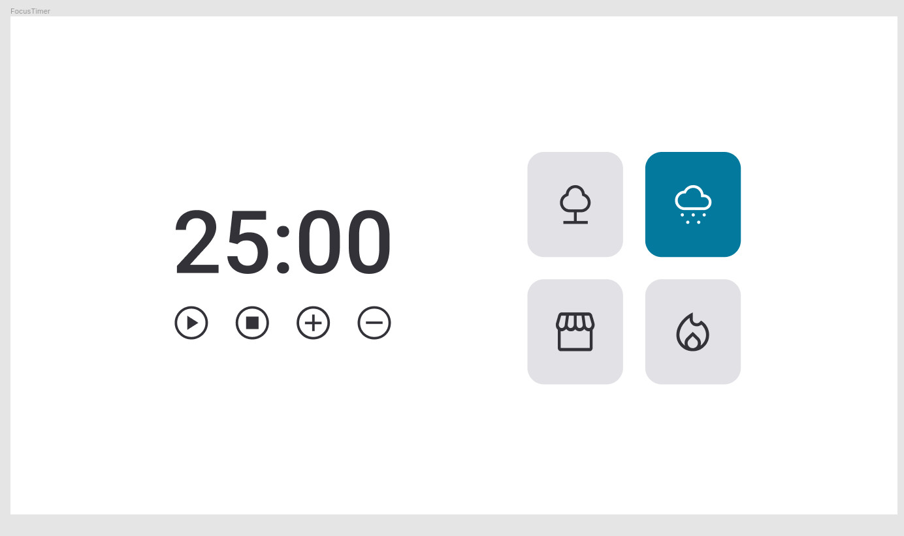

Check my work on <a href="https://github.com/EduhRodrigues/Explorer-Stage05-JS-FocusTimer.git"
">github.io/Explorer-Stage05-JS-FocusTimer</a>    

A ideia agora é criar o FocusTimer 2.0!  
Você receberá um link com o layout dessa nova versão, como você pode ver na imagem:    

  

Cada card que se encontra do lado direito, quando selecionado, vai mudar de cor e emitir um som diferente. Os sons você pode encontrar, respectivamente, nos links abaixo:

[**Floresta**](https://drive.google.com/file/d/1CRHkV72WUMdcqec5GT_KdsqFz0z3VAOA/view)

[**Chuva**](https://drive.google.com/file/d/1Ip8xBqAUJ-bty51Wz8JBtX_bWXCgA0P2/view)

[**Cafeteria**](https://drive.google.com/file/d/1OxLKpCwg2wrxXFNUHgZxJ51QEt0ac5RA/view)

[**Lareira**](https://drive.google.com/file/d/1MakaBPxJvTa_whaSM3kEbRcxiVd1GRCB/view)

Funcionalidades esperadas dos botões:

- Play: aciona o timer;
- Stop: pára o timer;
- Forward: aumenta em mais 1 minuto o tempo do timer;
- Back: diminui em 1 minuto o tempo do timer.

Obs: fique à vontade para adicionar animações ou alterar as cores dos cards. Belezinha? 😉
